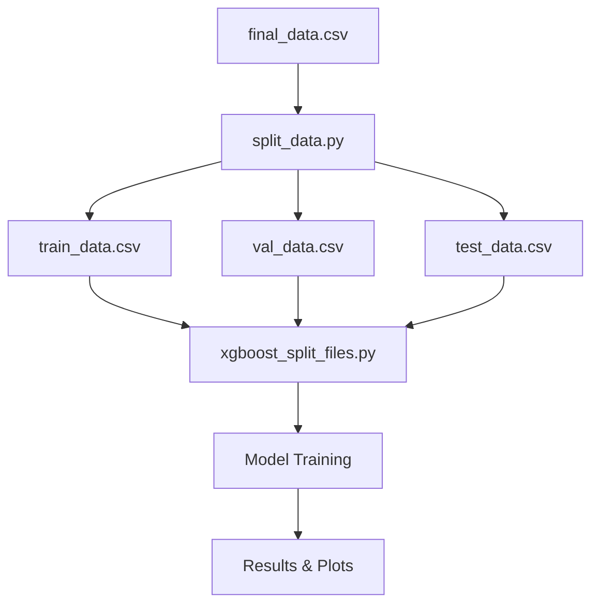

# XGBoost Split Files Approach

Hướng dẫn chia `final_data.csv` thành 3 file riêng biệt và training từ các file đó.

## 🎯 Lợi ích của Split Files Approach

### ✅ **Ưu điểm:**
- **Tổ chức data tốt hơn**: Mỗi file phục vụ mục đích riêng
- **Tiết kiệm thời gian**: Không cần chia data mỗi lần train
- **Kiểm soát tốt hơn**: Có thể kiểm tra từng set riêng biệt
- **Dễ debug**: Có thể test từng phần một cách độc lập
- **Tái sử dụng**: Dùng được cho nhiều experiments khác nhau

### 📊 **Tỉ lệ chia:**
- **Train**: 90% (dữ liệu cũ nhất)
- **Validation**: 5% (dữ liệu giữa)
- **Test**: 5% (dữ liệu mới nhất)

## 🚀 Hướng dẫn sử dụng

### Bước 1: Chia data
```bash
python split_data.py
```

**Output:**
```
train_data.csv    # 90% data cũ nhất
val_data.csv      # 5% data giữa  
test_data.csv     # 5% data mới nhất
```

### Bước 2: Training từ split files
```bash
python xgboost_split_files.py
```

## 📁 So sánh 2 Approaches

| Aspect | Original Approach | Split Files Approach |
|--------|------------------|---------------------|
| **Data Loading** | Đọc toàn bộ `final_data.csv` | Đọc 3 file riêng biệt |
| **Memory Usage** | Cao (load toàn bộ) | Thấp hơn (load từng phần) |
| **Flexibility** | Cần chia lại mỗi lần | Chia 1 lần, dùng nhiều lần |
| **Debugging** | Khó kiểm tra từng set | Dễ kiểm tra từng set |
| **Reproducibility** | Phụ thuộc vào code chia | Đảm bảo data cố định |

## 🔄 Workflow



## 📊 Data Flow

### Original Approach:
```
final_data.csv → load_data() → sort by time → create_sequences() → split 90%-5%-5% → train
```

### Split Files Approach:
```
final_data.csv → split_data.py → 3 separate files → load_split_data() → create_sequences() → train
```

## 🎛️ Configuration

### split_data.py
```python
def split_data_to_files(
    input_file='final_data.csv',    # Input file
    test_split=0.05,                # 5% cho test
    val_split=0.05                  # 5% cho validation
):
```

### xgboost_split_files.py
```python
def train_model_from_files(
    train_file='train_data.csv',    # Train file
    val_file='val_data.csv',        # Validation file  
    test_file='test_data.csv'       # Test file
):
```

## 📈 Kết quả Output

### Plots được tạo:
- `xgboost_split_files_comparison.png` - So sánh tất cả sets
- `xgboost_split_files_summary.png` - Tổng kết performance

### Console Output:
```
🚀 Training XGBoost từ Split Files
📖 Đọc dữ liệu từ các file riêng biệt...
✓ Train: XXXX rows - train_data.csv
✓ Val:   XXX rows - val_data.csv  
✓ Test:  XXX rows - test_data.csv

🎯 FINAL RESULTS (Split Files)
Train R²: X.XXXX
Val R²: X.XXXX
Test R²: X.XXXX
```

## 🔧 Customization

### Thay đổi tỉ lệ chia:
```python
# Trong split_data.py
result = split_data_to_files(
    test_split=0.1,    # 10% cho test
    val_split=0.1      # 10% cho validation
    # train sẽ là 80%
)
```

### Thay đổi tên file:
```python
# Trong xgboost_split_files.py
results = predictor.train_model_from_files(
    train_file='my_train.csv',
    val_file='my_val.csv', 
    test_file='my_test.csv'
)
```

## 🎯 Khi nào sử dụng Split Files?

### ✅ **Nên dùng khi:**
- Dataset lớn (>1GB)
- Cần thực hiện nhiều experiments
- Muốn kiểm tra data quality từng set
- Làm việc nhóm (share split cố định)
- Production deployment

### ❌ **Không cần khi:**
- Dataset nhỏ (<100MB)
- Chỉ run 1 lần
- Prototyping nhanh
- Thay đổi tỉ lệ chia thường xuyên

## 🚨 Lưu ý quan trọng

1. **Time Series Split**: Đảm bảo data được sắp xếp theo `datetime` trước khi chia
2. **No Data Leakage**: Train set luôn chứa data cũ hơn Test set
3. **Consistent Features**: Đảm bảo 3 file có cùng columns và format
4. **Test Set Slicing**: Code áp dụng slice `[3:-6]` cho test set như original

## 📋 Checklist

- [ ] `final_data.csv` có cột `datetime`
- [ ] Chạy `split_data.py` thành công
- [ ] 3 file được tạo: `train_data.csv`, `val_data.csv`, `test_data.csv`
- [ ] Kiểm tra kích thước files hợp lý
- [ ] Chạy `xgboost_split_files.py`
- [ ] So sánh kết quả với original approach 